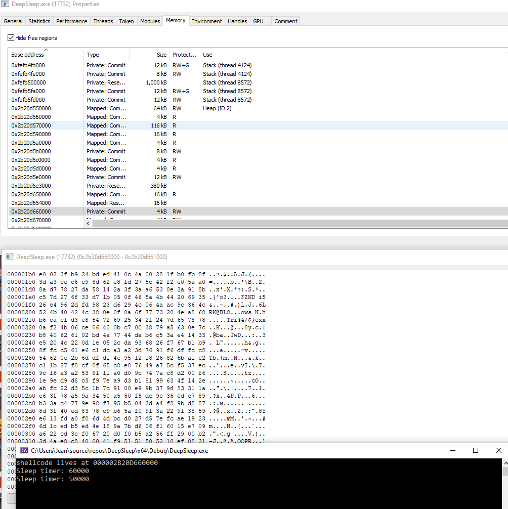

# DeepSleep
all credits go to @mgeeky

PoC in C that hooks sleep and encrypts shellcode page + changes permissions very much like https://github.com/mgeeky/ShellcodeFluctuation.
Uses functionhashing for epic malware emulation :P :P :P 
Just a fun little experiment :)

Here you see visually what I mean:
This is cobalt strike running (RX file permission with shellcode as is): 

 
This is cobalt strike sleeping(RW file permission with XOR'd shellcode):

